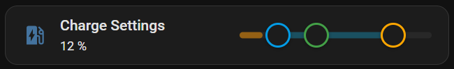
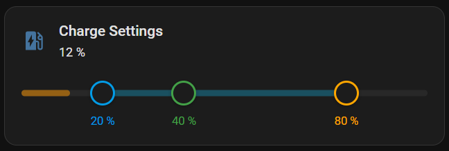

# Charging Slider Card

A Home Assistant Lovelace custom card providing a multi-handle slider for 2–3 linked `number` or `input_number` entities. Designed to match the visual style of HA Tile Cards.

**Use case:** Wallbox charging settings — control minimum charge, optional ideal charge target, and maximum charge in a single card.

---

## Features

- 2 or 3 handles (min / optional ideal / max)
- Enforces ordering: min < ideal < max with push behavior
- Optional state-of-charge (SoC) visualization as a colored bar along the track
- Two layout modes: **Inline** (slider next to title) and **Bottom** (slider below title with legend)
- Configurable icon with custom color
- Custom handle and SoC colors via HA's native `ui-color` picker
- Show current SoC value as secondary text below the title (configurable)
- Graphical card editor with entity pickers, icon picker, layout selector
- DE / EN localization
- Keyboard accessible (Arrow keys, Shift+Arrow for larger steps)

---

## Installation

### Via HACS (recommended)

1. In Home Assistant, open **HACS**
2. Click the 3-dot menu → **Custom repositories**
3. Enter `https://github.com/bjoernhardegen/charging-slider-card`, category: **Plugin**
4. Click **Add** → find "Charging Slider Card" in the list → **Download**
5. Reload your browser — no manual cache flush needed

### Manual

```bash
npm install
npm run build
```

Copy `dist/charging-slider-card.js` to `/config/www/` on your HA instance.

In HA → Settings → Dashboards → Resources, add:
- URL: `/local/charging-slider-card.js`
- Type: JavaScript module

---

## Configuration

### Minimal (YAML)

```yaml
type: custom:charging-slider-card
entities:
  min: number.charging_min
  max: number.charging_max
```

### Full example

```yaml
type: custom:charging-slider-card
title: Ladeeinstellungen
icon: mdi:ev-station
icon_color: primary
layout: inline              # "inline" (default) | "bottom"
show_state: true            # show SoC value below title
hide_state_when_zero: true  # hide state text when value is 0
entities:
  min:   number.charging_min
  ideal: number.charging_ideal   # optional
  max:   number.charging_max
  soc:   sensor.car_battery      # optional, read-only
colors:
  min:   blue
  ideal: green
  max:   orange
  soc:   cyan
```

### Options

| Key | Type | Default | Description |
|---|---|---|---|
| `title` | string | — | Card title (optional) |
| `icon` | string | — | MDI icon, e.g. `mdi:ev-station` (optional) |
| `icon_color` | string | `#44739e` | Icon color — any HA `ui-color` value (`primary`, `red`, `blue`, …) |
| `layout` | `inline` \| `bottom` | `inline` | Inline: slider next to title. Bottom: slider below title with value legend. |
| `show_state` | boolean | `false` | Show the SoC value as secondary text below the title |
| `hide_state_when_zero` | boolean | `false` | Hide the state text when the SoC value is 0 |
| `entities.min` | string | **required** | Entity ID for minimum value (`number` or `input_number`) |
| `entities.ideal` | string | — | Entity ID for ideal/target value (optional) |
| `entities.max` | string | **required** | Entity ID for maximum value (`number` or `input_number`) |
| `entities.soc` | string | — | Entity ID for state of charge — displayed as read-only bar (`sensor`, `number`, `input_number`) |
| `colors.min` | string | `--info-color` | Handle and legend color for min |
| `colors.ideal` | string | `--success-color` | Handle and legend color for ideal |
| `colors.max` | string | `--warning-color` | Handle and legend color for max |
| `colors.soc` | string | `--primary-color` | Color of the SoC bar |

Color values follow HA's `ui-color` selector: `primary`, `accent`, `red`, `pink`, `purple`, `deep-purple`, `indigo`, `blue`, `light-blue`, `cyan`, `teal`, `green`, `light-green`, `lime`, `yellow`, `amber`, `orange`, `deep-orange`, `brown`, `grey`, `blue-grey`.

---

## Layout modes

### Inline (default)
Title/icon occupy 50% of the card width, slider takes the other 50%.



### Bottom
Slider spans the full card width below the title. Value labels are shown beneath each handle.



---

## Development

```
src/
├── charging-slider-card.ts   # Main card component
├── editor.ts                 # Lovelace card editor
├── styles.ts                 # CSS (HA CSS variables)
└── types.ts                  # TypeScript interfaces
```

The card uses imperative DOM management for slider handles to avoid Lit re-render conflicts during drag. Pointer events are attached to `document` (not the handle element) for compatibility with HA's Shadow DOM event handling.

```bash
npm run build   # builds dist/charging-slider-card.js
```
