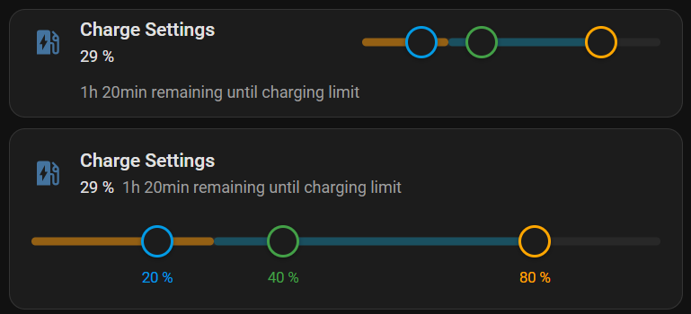

# Charging Slider Card

A Home Assistant Lovelace custom card providing a multi-handle slider for 2–3 linked `number` or `input_number` entities. Designed to match the visual style of HA Tile Cards.

**Use case:** Wallbox charging settings — control minimum charge, optional ideal charge target, and maximum charge in a single card.


---

## Features

- 2 or 3 handles (min / optional ideal / max)
- Enforces ordering: min < ideal < max with push behavior
- Optional state-of-charge (SoC) visualization as a colored bar along the track
- Optional charging time remaining — displayed as secondary text
- Optional charging power entity — animates the SoC bar at speed proportional to current power
- Two layout modes: **Inline** (slider next to title) and **Bottom** (slider below title with legend)
- Configurable icon with custom color
- Custom MDI icon per handle (min / ideal / max)
- Custom handle, SoC and charging time colors via HA's native `ui-color` picker
- Show current SoC value as secondary text below the title (configurable)
- **Override entity**: Link a `switch` or `input_boolean` to dim and lock configured handles; lightning-bolt icon button in the header toggles the entity
- Graphical card editor with grouped, collapsible sections (HA Tile Card style)
- DE / EN localization

---

## Installation

### Via HACS (recommended)

1. In Home Assistant, open **HACS**
2. Click the 3-dot menu → **Custom repositories**
3. Enter `https://github.com/bjoernhardegen/charging-slider-card`, category: **Dashboard**
4. Click **Add** → find "Charging Slider Card" in the list → **Download**
5. Reload your browser

### Manual

```bash
npm install
npm run build
```

Copy `dist/charging-slider-card.js` to `/config/www/` on your HA instance.

In HA → Settings → Dashboards → Resources, add:
- URL: `/local/charging-slider-card.js`
- Type: JavaScript module

---

## Configuration

### Minimal (YAML)

```yaml
type: custom:charging-slider-card
entities:
  min: number.charging_min
  max: number.charging_max
```

### Full example

```yaml
type: custom:charging-slider-card
title: Ladeeinstellungen
icon: mdi:ev-station
icon_color: primary
layout: inline                # "inline" (default) | "bottom"
show_state: true              # show SoC value below title
hide_state_when_zero: true    # hide state text when value is 0
charging_time_color: primary  # text color for charging time
charging_power_max: 11000     # max power in watts for animation scaling (default: 11000)
entities:
  min:              number.charging_min
  ideal:            number.charging_ideal           # optional
  max:              number.charging_max
  soc:              sensor.car_battery              # optional, read-only
  charging_time:    sensor.charging_time_remaining  # optional, read-only
  charging_power:   sensor.charging_power           # optional, read-only
  override_entity:  switch.charging_override        # optional
override_ignore: ideal        # "ideal" (default) | "min" | "min_ideal"
handle_icons:
  min:   mdi:play
  ideal: mdi:pause
  max:   mdi:stop
colors:
  min:      blue
  ideal:    green
  max:      orange
  soc:      cyan
  override: orange
```

### Options

| Key | Type | Default | Description |
|---|---|---|---|
| `title` | string | — | Card title (optional) |
| `icon` | string | — | MDI icon, e.g. `mdi:ev-station` (optional) |
| `icon_color` | string | — | Icon color — any HA `ui-color` value (`primary`, `red`, `blue`, …) |
| `layout` | `inline` \| `bottom` | `inline` | Inline: slider next to title. Bottom: slider below title with value legend. |
| `show_state` | boolean | `false` | Show the SoC value as secondary text below the title |
| `hide_state_when_zero` | boolean | `false` | Hide the state text when the SoC value is 0 |
| `charging_time_color` | string | — | Text color for charging time — any HA `ui-color` value |
| `charging_power_max` | number | `11000` | Maximum charging power in watts — used to scale SoC bar animation speed |
| `entities.min` | string | **required** | Entity ID for minimum value (`number` or `input_number`) |
| `entities.ideal` | string | — | Entity ID for ideal/target value (optional) |
| `entities.max` | string | **required** | Entity ID for maximum value (`number` or `input_number`) |
| `entities.soc` | string | — | Entity ID for state of charge — displayed as read-only bar (`sensor`, `number`, `input_number`) |
| `entities.charging_time` | string | — | Entity ID for charging time remaining — displayed as secondary text (`sensor`, `input_text`) |
| `entities.charging_power` | string | — | Entity ID for current charging power — animates the SoC bar, speed scales with power (`sensor`, `number`, `input_number`) |
| `entities.override_entity` | string | — | Entity ID for override toggle (`switch`, `input_boolean`, `binary_sensor`) |
| `override_ignore` | `ideal` \| `min` \| `min_ideal` | `ideal` | Which handles to dim and lock when override entity is active |
| `handle_icons.min` | string | — | MDI icon inside the minimum handle, e.g. `mdi:play` |
| `handle_icons.ideal` | string | — | MDI icon inside the ideal handle, e.g. `mdi:pause` |
| `handle_icons.max` | string | — | MDI icon inside the maximum handle, e.g. `mdi:stop` |
| `colors.min` | string | — | Handle and legend color for min |
| `colors.ideal` | string | — | Handle and legend color for ideal |
| `colors.max` | string | — | Handle and legend color for max |
| `colors.soc` | string | — | Color of the SoC bar |
| `colors.override` | string | — | Color of the override icon button when active |

Color values follow HA's `ui-color` selector: `primary`, `accent`, `red`, `pink`, `purple`, `deep-purple`, `indigo`, `blue`, `light-blue`, `cyan`, `teal`, `green`, `light-green`, `lime`, `yellow`, `amber`, `orange`, `deep-orange`, `brown`, `grey`, `blue-grey`.

---

## Layout modes

### Inline (default)

Title/icon occupy 50% of the card width, slider takes the other 50%. SoC value and charging time remaining appear below the title. In inline mode, the charging time text spans the full card width below the slider.


### Bottom

Slider spans the full card width below the title. Value labels are shown beneath each handle. SoC value and charging time remaining appear on the same line next to the title.


### With charging time remaining



---

## Development

```
src/
├── charging-slider-card.ts   # Main card component
├── editor.ts                 # Lovelace card editor
├── styles.ts                 # CSS (HA CSS variables)
└── types.ts                  # TypeScript interfaces
```

The card uses imperative DOM management for slider handles to avoid Lit re-render conflicts during drag. Pointer events are attached to `document` (not the handle element) for compatibility with HA's Shadow DOM event handling.

```bash
npm run build   # builds dist/charging-slider-card.js
```

### Releasing a new version

Use an **annotated tag** — the message is used as the GitHub Release body and displayed in HACS:

```bash
git tag -a vX.Y.Z -m "## vX.Y.Z — Short description

- Feature A
- Feature B"

git push origin main
git push origin vX.Y.Z
```

GitHub Actions builds and publishes the release automatically. The tag message appears as release notes in HACS.
